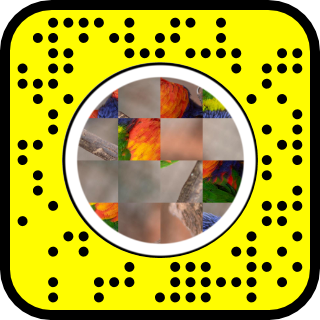

# Expo - Snapchat Lens 

Transform your space into a virtual photo exhibition with this interactive Snapchat filter! Using augmented reality and image recognition, this lens overlays artworks onto walls, creating a unique and immersive gallery experience through the Snapchat app.

| No Filter | With Filter |
| --- | --- |
| <video controls src="Extern/preview-nofilter.mp4"></video> | <video controls src="Extern/preview-filter.mp4"></video> |

## Features

- **Image Marker Recognition**: Detects printed markers and displays the corresponding artwork automatically.
- **Augmented Reality**: Seamlessly overlays digital art onto physical walls.
- **Interactive Experience**: Explore a gallery-like setup using just your phone.

## How to Use the Filter

1. Print the image markers provided in the `Extern` folder, or display them on a screen.
2. Open the Snapchat app and scan the Snapcode below to unlock the filter.
3. Point your camera at the markers to bring the exhibition to life!

## How to Edit the Project

This filter was created using Lens Studio. To customize or contribute:

1. Download and install [Lens Studio](https://lensstudio.snapchat.com/).
2. Open the project file included in this repository.
3. Edit the image markers, 3D assets, or scripts to match your needs.
4. Publish your updated filter and test it on Snapchat.

## Folder Overview

- **`Assets`**: Contains the resources used in the Lens Studio project.
- **`Extern/`**: Includes resources for creating assets, such as 3D models and image markers.

## Credits & License

All images used in this project are from [Unsplash](https://unsplash.com/fr/@enzodeg40) and are licensed under the [Unsplash License](https://unsplash.com/license).
